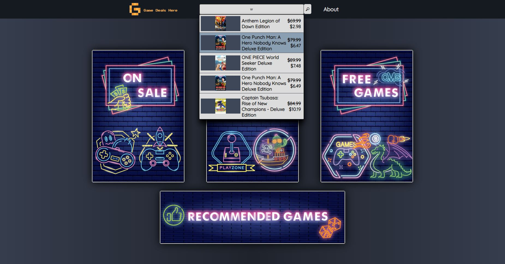

# Game Deals Page

Game deals fetching App, using [CheapShark API](https://apidocs.cheapshark.com/)

[The Website](https://exoldarium.github.io/Game-Deals-Page/)

## General info
Decide to build this app as my first project. I've decided to build this app without using any framworks,  compilers and libraries as a way to learn more about 
JavaScript, CSS and HTML and as a way to challenge myself.

One of the challenges was being able to correctly show and persist the filtered data that the user searches. I've learned a lot about promises, asynchronous side
of JavaScript and how to work with an API and display the data i need. I will probaly update and improve the code as i learn more.

The images were designed by my lovely wife.

## To-do
Add pagination

Add some sort of log-in function

	
## Technologies
Project is created with:
* JavaScript ES6
* CSS
* HTML
* CheapShark API
## License

This project is licensed under the MIT License - see the [LICENSE.md](LICENSE.md) file for details
